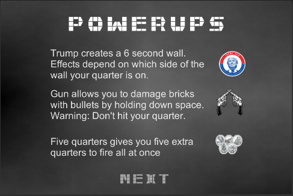

# Looter

### About 
This application is, as of January 2017, the largest project I've built yet. I created the project around December 2016, and since then, I've focused less on Unity and more on web development and machine learning. I'm sad to leave Unity behind, but I wish to create impactful projects, and I think that's easier with the new fields I'm getting into. 
    
### Game Play
This is a block breaker variant.  Smash the faces of presidents to collect dollars. You can play the game here: https://jenniezheng321.github.io/Looter/

